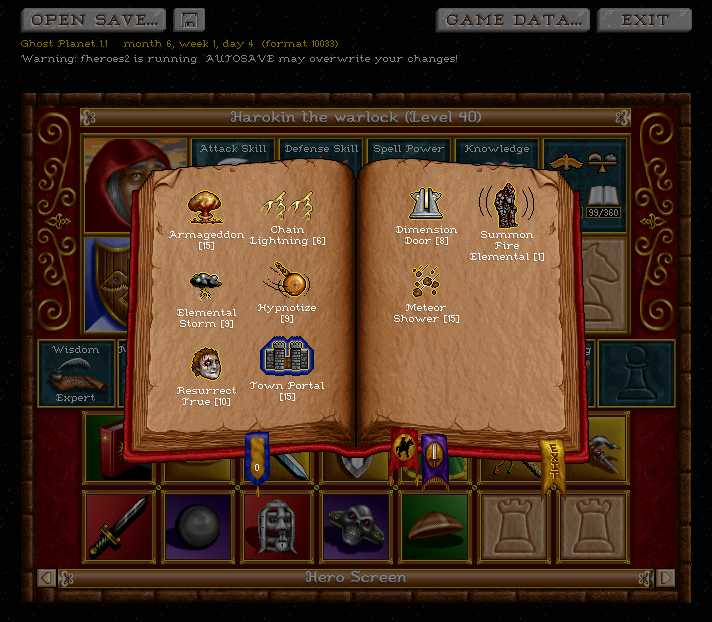
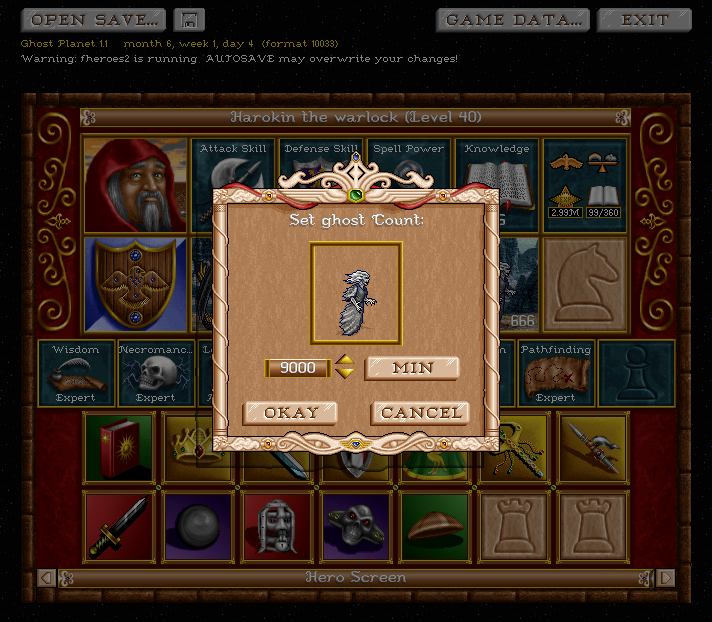
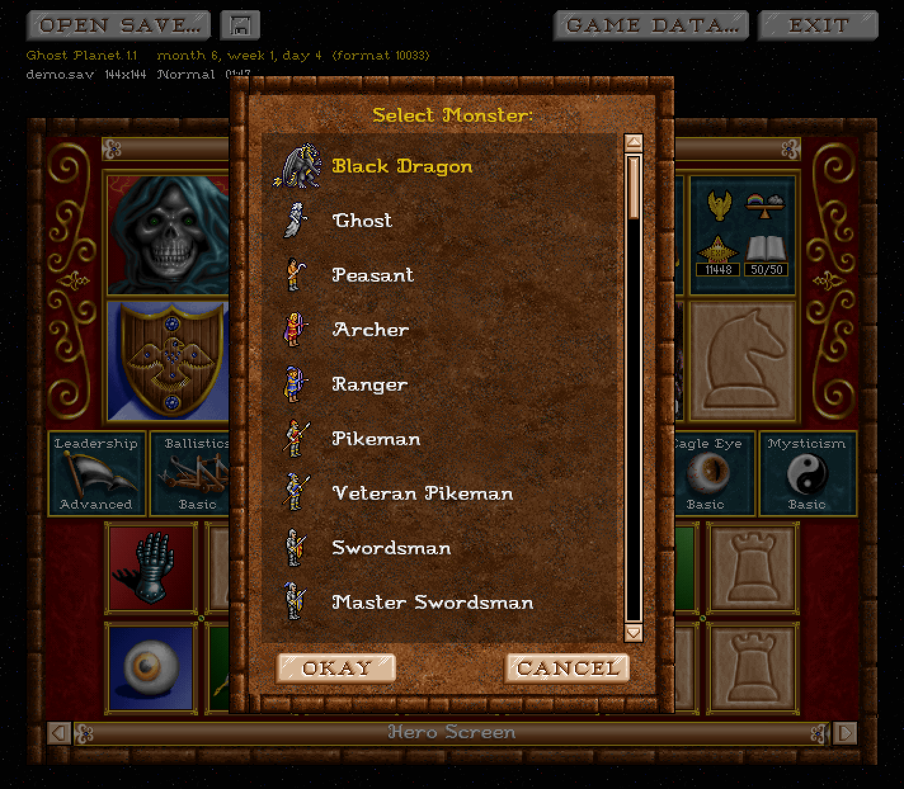
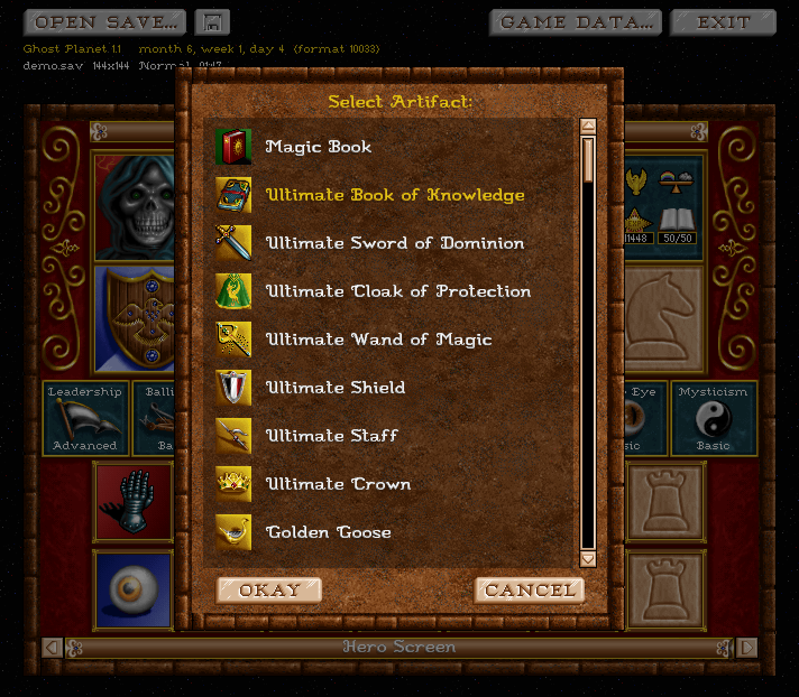
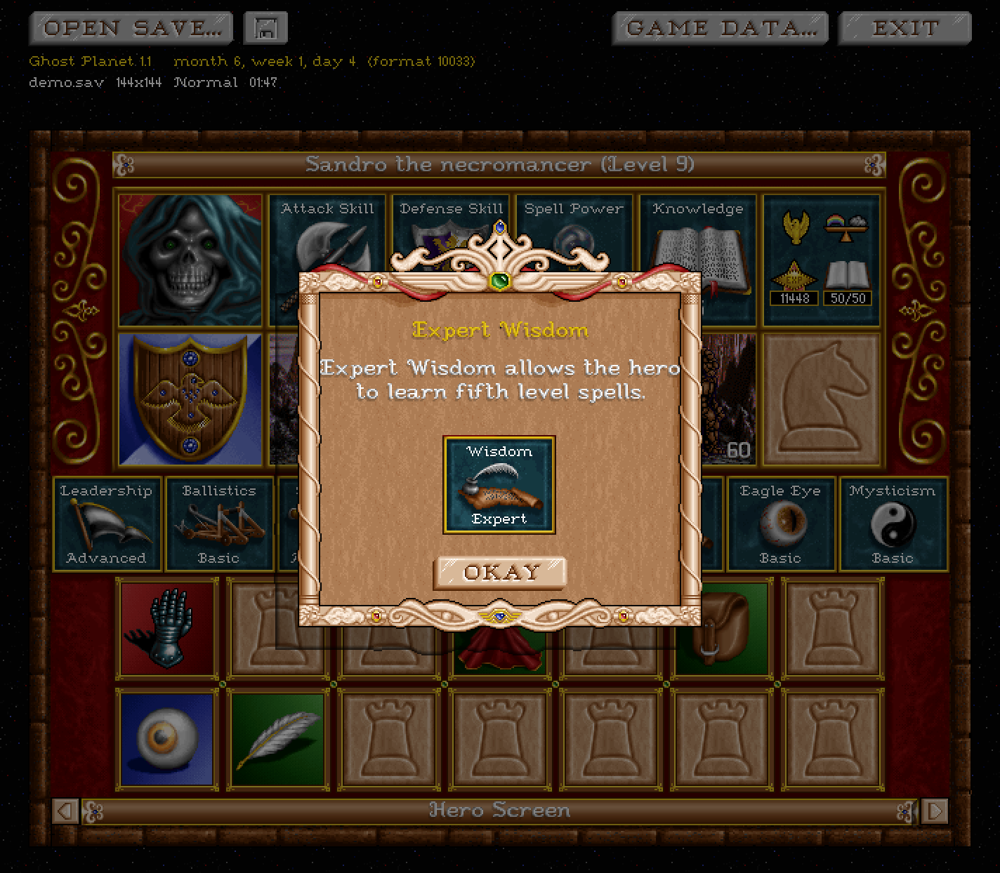
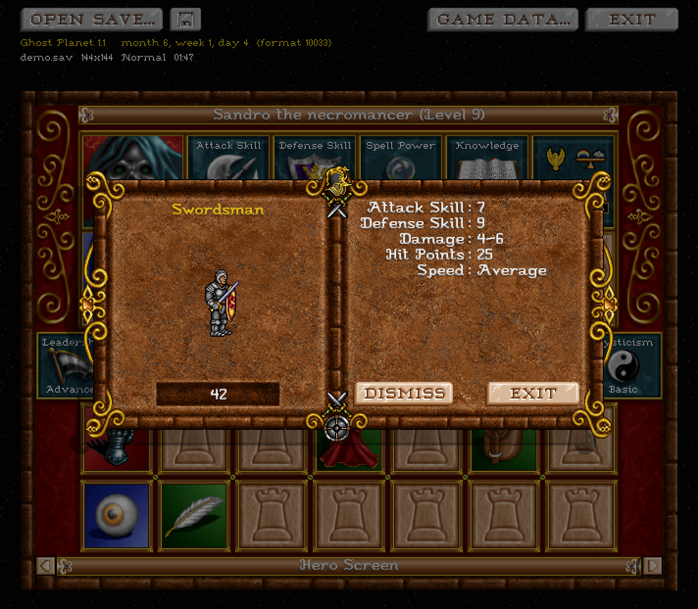

# fheroes2 Save Editor

[](https://github.com/slavamokerov/fheroes2-save-editor/actions/workflows/build.yml)
[](LICENSE)
[](https://slavamokerov.github.io/fheroes2-save-editor/)

**Try it online:** <https://slavamokerov.github.io/fheroes2-save-editor/>

A graphical save-file editor for [fheroes2](https://github.com/ihhub/fheroes2)
— an open-source reimplementation of Heroes of Might and Magic II.

The editor opens `*.sav`, `*.savc`, `*.savm`, `*.savh` files (formats 10032–10034)
and lets you change hero armies, primary and secondary skills, artifacts, spells,
experience, spell points, portraits and names — with the same look and feel as
the in-game hero screen. In the desktop version, all graphics (portraits,
monsters, icons, fonts) are extracted directly from the game's `HEROES2.AGG`
archive at runtime.

The hero screen is a port of the window from [fheroes2](https://github.com/ihhub/fheroes2)'s
map editor, and this project owes a lot to the engine's authors. Game resources
(AGG/ICN/KB.PAL) are read by our own loader ([src/aggicn.cpp](src/aggicn.cpp),
[src/aggicn.h](src/aggicn.h)), and the save layout is documented in
[`FH2_SAVE_FORMAT.md`](FH2_SAVE_FORMAT.md). The save format rarely changes and
has stayed stable for years — if a future fheroes2 release ever changes it,
the editor will be updated.

## Contents

- [Download](#download)
- [Screenshots](#screenshots)
- [Features](#features)
- [Command line](#command-line)
- [Building from source](#building-from-source)
- [Architecture](#architecture)
- [Tests](#tests)
- [Debugging](#debugging)
- [FAQ](#faq)
- [Credits](#credits)
- [License](#license)

## Download

**Web editor** — no installation, runs entirely in your browser:
<https://slavamokerov.github.io/fheroes2-save-editor/>
It edits everything the desktop app edits — just without the in-game
graphics — and downloads the result as a new file.

Prebuilt desktop binaries are attached to [GitHub Releases](https://github.com/slavamokerov/fheroes2-save-editor/releases):

[-Download-000000?style=for-the-badge&logo=apple&logoColor=white)](https://github.com/slavamokerov/fheroes2-save-editor/releases/latest/download/fheroes2-save-editor-macos-arm64.dmg)  
`.dmg` for Apple Silicon. Ad-hoc signed: on first launch right-click → Open
(or `xattr -dr com.apple.quarantine`).

[-Download-000000?style=for-the-badge&logo=apple&logoColor=white)](https://github.com/slavamokerov/fheroes2-save-editor/releases/latest/download/fheroes2-save-editor-macos-intel.dmg)  
`.dmg` for Intel Macs. Ad-hoc signed: on first launch right-click → Open
(or `xattr -dr com.apple.quarantine`).

[](https://github.com/slavamokerov/fheroes2-save-editor/releases/latest/download/fheroes2-save-editor-windows-x64.zip)  
`.zip` with the portable build; unpack it and run `fheroes2-save-editor.exe`.
SmartScreen may warn because the app is unsigned.

[-Download-FCC624?style=for-the-badge&logo=linux&logoColor=black)](https://github.com/slavamokerov/fheroes2-save-editor/releases/latest/download/fheroes2-save-editor-linux-x64.AppImage)  
`.AppImage` (x86-64, built on Ubuntu 22.04 for wide glibc compatibility):
`chmod +x fheroes2-save-editor-linux-x64.AppImage`, then run it.

The buttons link straight to the latest release assets; older versions are on
the [Releases](https://github.com/slavamokerov/fheroes2-save-editor/releases) page.

You need the game data of Heroes of Might and Magic II: the editor reads
`HEROES2.AGG` from the fheroes2 data folder (usually
`~/Library/Application Support/fheroes2/data` on macOS,
`%LOCALAPPDATA%\fheroes2\data` on Windows). No game files are distributed
with this project.

## Screenshots

<p align="center">
  
</p>

<table>
  <tr>
    <td align="center"><br>The spell book</td>
    <td align="center"><br>Setting the army count</td>
    <td align="center"><br>Creature window</td>
  </tr>
  <tr>
    <td align="center"><br>Artifact window</td>
    <td align="center"><br>Secondary skill info</td>
    <td align="center"><br>Army info</td>
  </tr>
</table>

## Features

- **Hero screen** — the same screen as in the game: portrait, crest, class and
  level, the four primary skills, morale and luck, experience and spell points,
  the army, secondary skills and artifacts, plus buttons to switch between
  heroes. The window header shows the map name, the in-game date, the save
  file name, the map size, the difficulty and the save time.
- **Army** — click an empty slot to add any creature in any number; click a
  stack to move, merge or swap it; double-click to open the creature window
  (animation, stats, dismiss with confirmation); right-click to remove a stack.
- **Primary skills** — click a skill to set its value; right-click to reset all
  of them to the race defaults.
- **Experience and spell points** — click to set a value; right-click to reset.
- **Secondary skills** — click to read the description or pick a new skill;
  right-click to reset to the race's starting skill.
- **Artifacts** — all 81 artifacts plus the Magic Book; click to pick one,
  click another slot to move or swap; double-click for the description; the
  spell book opens straight from the artifact bar.
- **Spell book** — add or remove any of the 65 spells, flip pages, read spell
  descriptions.
- **Name and portrait** — click the title to rename the hero, the portrait to
  change it; right-click to revert. The name keeps the original number of
  characters.
- **Language** — the interface follows the language of your fheroes2
  installation. All game texts (monster, spell, artifact and skill names and
  descriptions) come from fheroes2's own translation files, so every language
  supported by the game works out of the box.
- **Backup** — the desktop version makes a `.bak` copy of the save before
  the first save; a warning appears if fheroes2 is running, because AUTOSAVE
  may overwrite your changes.
- **Web version** — the same editor compiled to WebAssembly: everything above
  is editable in the browser, just without the game graphics. The edited file
  is downloaded as a new file instead of overwriting the opened one.
- **Command line** — `fheroes2-save-editor --add <file.sav> <hero_name> <monster_id> <count>`
  adds a troop to a hero without opening the interface (see
  [Command line](#command-line)).

## Command line

Adds a troop to a hero without opening the interface — handy for scripts:

```text
fheroes2-save-editor --add <file.sav> <hero_name> <monster_id> [count]
```

```bash
# 10 Black Dragons for Gem
fheroes2-save-editor --add AUTOSAVE.sav Gem 38 10

# 5 Titans for Sandro
fheroes2-save-editor --add AUTOSAVE.sav Sandro 47 5

# 1 Phoenix for Solmyr (count defaults to 1)
fheroes2-save-editor --add AUTOSAVE.sav Solmyr 29
```

The hero name is a single argument — quote it only when it contains spaces,
otherwise the shell splits it into two arguments:

```bash
# 50 Crusaders for Crag Hack
fheroes2-save-editor --add AUTOSAVE.sav "Crag Hack" 11 50
```

The hero is matched by its name in the save or by the default hero name
([§12.3](FH2_SAVE_FORMAT.md#123-hero-id-int32-heroes-enum-heroesh)); monster IDs
are listed in [§12.1](FH2_SAVE_FORMAT.md#121-monster-id-int32-monstermonstertype-monsterh)
of the format doc. The troop goes into a slot that already holds the same
monster, otherwise into an empty slot, otherwise into the first slot. A `.bak`
backup is created before saving.

## Building from source

Dependencies: CMake ≥ 3.21, Qt6 (Widgets), a C++17 compiler. zlib is fetched
automatically via FetchContent.

**macOS / Linux** — one command (installs Qt via Homebrew on first run):

```bash
./scripts/run.sh
```

Manually:

```bash
cmake -S . -B build -DCMAKE_PREFIX_PATH="$(brew --prefix qt)" -DCMAKE_BUILD_TYPE=Release
cmake --build build -j
open build/fheroes2-save-editor.app        # macOS
./build/fheroes2-save-editor               # Linux
```

**Windows** — [build-win.ps1](scripts/build-win.ps1) (PowerShell; requires Visual Studio 2022 and
Qt6, pass the Qt path with `-QtDir`).

### Opening a save

```bash
fheroes2-save-editor "~/Library/Application Support/fheroes2/files/save/AUTOSAVE.sav"
```

or just pass the file to the app, or use OPEN SAVE... in the toolbar.

## Architecture

```text
MainWindow
 └─ CentralWidget (CLOF32.TIL background, game-style toolbar, map name/date)
      └─ HeroPanel (640×480 hero screen, scale ×1)
           ├─ HEROBKG+HEROEXTG background, portrait, crest, title
           ├─ primary skills, morale/luck, experience/mana
           ├─ army: 5 cells (race STRIP frame + monster + count + RECRUIT +/−)
           ├─ secondary skills (8), artifacts (14)
           └─ prev/next buttons (HSBTNS) + status line with hints
 └─ Assets → AggContainer / ICN decoder (own implementation, no fheroes2 code)
```

- **SaveFile** ([src/savefile.cpp](src/savefile.cpp), [src/savefile.h](src/savefile.h), Qt-free core) — reads the header, inflates the
  zlib block (big-endian serialization, see [`FH2_SAVE_FORMAT.md`](FH2_SAVE_FORMAT.md)), scans hero
  records and recovers HeroBase (primary skills, mana, artifacts) by backward
  scanning. All edits write values **at the same offsets** — the stream size
  never changes; `save()` recompresses the stream and rewrites the whole file.
- **Assets/aggicn** — own resource loader: AGG container (hash/offset/size
  table + 8.3 names), ICN decoder (RLE opcodes + transform layer, monochrome
  sprites), KB.PAL palette (6-bit ×4 + cyclic color copies). Transparency is
  `transform==1`; color indexes are kept in `IcnSprite::idx` for font
  recoloring. Data paths: `~/Library/Application Support/fheroes2/data`,
  `~/.local/share/fheroes2/data`, `%LOCALAPPDATA%\fheroes2\data`, etc.
- **HeroPanel** — manual drawing and hit tests (areas + sprites, like the game),
  press-and-hold auto-repeat for the +/- buttons.

### Important invariants

- Save format: **big-endian**, `u32 length + bytes` for strings, versions
  10032–10034. Details in [`FH2_SAVE_FORMAT.md`](FH2_SAVE_FORMAT.md).
- All setters keep the stream length unchanged — this allows saving without
  risking the neighboring structures. Hero names can only be changed to the
  same length; artifacts are added/removed by rebuilding the bag.
- The hero position center is **i16×2**, not i32×2
  ([§6.1](FH2_SAVE_FORMAT.md#61-herobase) of the doc).
- A hero's artifact bag can be smaller than 14 slots (count 0..14).
- Saving to an open file creates a `.bak` first (once).
- If fheroes2 is running, AUTOSAVE will overwrite your edits — the editor
  warns in the status line (pgrep check, macOS only).
- `hero.portrait` and `hero.heroId` are indexes into PORT00xx (id−1), see
  [constants.cpp](src/constants.cpp).

## Tests

The core round-trip tests (`tests/core_test.cpp`) run against the developer's
own save files and are kept out of the repository on purpose — contributors
can point the test runner at any fheroes2 saves folder:

```bash
FH2_SAVE_DIR="$HOME/Library/Application Support/fheroes2/files/save" ctest --test-dir build
```

Tests write only to temporary files and never modify the original saves.

## Debugging

Debug environment variables for snapshots and UI checks (all of them need a
save to open):

```bash
# snapshot the main window and exit
FH2_DEBUG_SHOT=hero.png fheroes2-save-editor "AUTOSAVE.sav"

# open the spell book dialog and snapshot it
FH2_DEBUG_DIALOG=book FH2_DEBUG_SHOT=spellbook.png fheroes2-save-editor "AUTOSAVE.sav"

# show a specific hero, force the UI language, snapshot
FH2_DEBUG_HERO="Crag Hack" FH2_UI_LANG=ru FH2_DEBUG_SHOT=hero-ru.png fheroes2-save-editor "AUTOSAVE.sav"
```

- `FH2_DEBUG_SHOT=<file.png>` — the app saves a snapshot of the main window to
  PNG and exits (useful for checking rendering without running the game).
- `FH2_DEBUG_DIALOG=<name>` — opens a dialog to snapshot it:
  `book`, `monster`, `artifact`, `hero`, `spell`, `skill`, `count`, `message`,
  `numpad`, `armyinfo`, `spellinfo`, `skillinfo`, `artifactinfo`, `primcount`,
  `expcount`, `monstercount`.
- `FH2_DEBUG_HERO=<name>` — selects a hero right after opening the save.
- `FH2_UI_LANG=<lang code>` — overrides the UI language.

The variables are compiled into the regular release builds on all platforms
(macOS, Windows, Linux) — no separate debug build exists. Only the syntax
differs on Windows:

```bat
:: cmd.exe
set FH2_DEBUG_SHOT=hero.png && fheroes2-save-editor.exe "AUTOSAVE.sav"
```

```powershell
# PowerShell
$env:FH2_DEBUG_SHOT="hero.png"; .\fheroes2-save-editor.exe "AUTOSAVE.sav"
```

## FAQ

**How does it work?**

Open a save, edit your heroes, save it back. The web editor runs entirely in
your browser and downloads the result as a new file; the desktop editor reads
the file from disk and makes a `.bak` backup before the first save.

**What's the difference between the web and the desktop version?**

Both edit exactly the same things. The web version has no in-game graphics —
the same fields on a plain page. The desktop version looks like the hero
screen from the game (portraits, sprites, the spell book) and reads
`HEROES2.AGG` from your fheroes2 data folder.

**Do I need the game files?**

Web — no, nothing to install or configure. Desktop — yes, the editor reads
`HEROES2.AGG` from the fheroes2 data folder; no game files are distributed
with this project.

**Where are my fheroes2 saves?**

- macOS — `~/Library/Application Support/fheroes2/files/save`
- Windows — `%LOCALAPPDATA%\fheroes2\files\save`
- Linux — `~/.local/share/fheroes2/files/save`

**Which save formats are supported?**

`*.sav`, `*.savc`, `*.savm`, `*.savh` (fheroes2 save versions 10032–10034).
Saves of the original Heroes of Might and Magic II are not supported.

**Why did my changes disappear?**

If fheroes2 is running, AUTOSAVE can overwrite your edits. The desktop editor
shows a warning in the status line — close fheroes2 or edit a copy of the save.

**Will a fheroes2 update break the editor?**

The save format has stayed stable for years. If a future fheroes2 release ever
changes it, the editor will be updated.

**Where is the save format documented? How do I build and test?**

The format is described in [`FH2_SAVE_FORMAT.md`](FH2_SAVE_FORMAT.md). Building
instructions are in [Building from source](#building-from-source); tests are
described in [Tests](#tests).

**Something's broken or you have an idea?**

Open an [issue](https://github.com/slavamokerov/fheroes2-save-editor/issues).

## Credits

- [fheroes2](https://github.com/ihhub/fheroes2) — the open-source engine this
  editor is modeled after; parts of this codebase are ports of fheroes2
  routines (glyph generation, button font, shadows, hero screen and dialog
  geometry, status-bar texts).
- Heroes of Might and Magic II © Ubisoft — all graphics are extracted from the
  game's own archives at runtime and are not distributed here.
- App icon — “Equestrian” from the [Chikin 365](https://sergeychikin.ru/365/)
  icon set by [Sergey Chikin](https://sergeychikin.ru/).

## License

GPL-2.0 (see [LICENSE](LICENSE)). A significant part of the code is ported from
fheroes2 (GPL-2.0); no fheroes2 sources are included in this project.

32167
